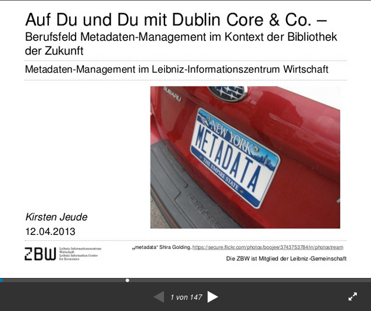

# 2.1.1 Metadatenformate und -standards

## Präsentation Kirsten Jeude (2013)

http://www.slideshare.net/suvanni/auf-du-und-du-mit-dublin-core-co-berufsfeld-metadatenmanagement-im-kontext-der-bibliothek-der-zukunft

## Interview mit Kirsten Jeude
ZBW Podcast: ["Kirsten Jeude - Die Datenübersetzerin"](https://www.youtube.com/watch?v=YwbRTDvt_sA)

## Kernpunkte

* Es gibt viele verschiedene Definitionen für Metadaten, je nach Perspektive (z.B. der IT, der KatalogbastlerInnen, der BibliothekarInnen usw.). Grundsätzlich sind es (vgl. Folie 13) **strukturierte "Daten über Daten"**, also eine formale Beschreibung einer Vielzahl von Dingen (Texte, Bilder, Objekte, Personen, usw.). Metadaten sollen u.a. das Auffinden, Identifizieren, Auswählen und den Zugang zu einer Ressource erleichtern. Metadaten können getrennt vom beschriebenen Objekt in einer separaten Datei gespeichert oder in das Objekt eingebettet sein. Bilddateien wie JPG enthalten zum Beispiel eingebettete Metadaten (Aufnahmedatum, Auflösung usw.).
* Da die Anforderungen an Metadaten kontextabhängig sind, gibt es eine Vielzahl an Standards, die sich entwickelt haben. Beispiele im Bibliothekswesen sind **PICA, MODS, DC, MAB, MARC21, METS, EAD, TEI, LIDO** (vgl. Folie 44). Diese Standards können technisch in verschiedenen Formaten (Text, XML) umgesetzt werden. Die Regeln der Standards werden oft in einem **Schema** dokumentiert, mit dem sich prüfen lässt, ob eine Datei (technisch) standardkonform ist. Wenn eine Anwendung genauere Festlegungen treffen will oder gar Elemente aus verschiedenen Standards kombiniert werden sollen, dann wird dies in einem **Anwendungsprofil** festgelegt (vgl. Folie 59).
* Um Metadaten aus verschiedenen Quellen zusammenzuführen, ist meist ein "Übersetzen" der Daten aus verschiedenen Quellschemas (MARC21, PICA) in ein einheitliches Zielschema notwendig. Dieser Prozess wird **Mapping (oder auch "Crosswalk")** genannt. Dabei gehen je nach Schema mehr oder weniger Informationen verloren. Es gibt Standard-Crosswalks zwischen Metadatenstandards, die als Grundlage dienen können. Da aber jede Einrichtung die Daten etwas anders erfasst (ist ja nur menschlich), lohnt es sich immer in die Daten zu schauen, wie die einzelnen Metadatenfelder wirklich befüllt sind. Die meisten Mappings werden daher teils auf Basis von Standard-Crosswalks, teils auf Basis von Beispieldaten erstellt (zu Problemen beim "Mapping in der Praxis" vgl. die Folien 70ff).
* Für den Austausch von Metadaten gibt es **Schnittstellen wie Z39.50, SRU oder OAI-PMH** (vgl. Folie 86ff).

## Literatur
* Wikipedia zu Metadaten: https://de.wikipedia.org/wiki/Metadaten
* Onlinetutorial "Einführung in Metadaten und Metadatenformate" von Claudia Effenberger und Stefanie Rühle: http://moodle.dnb.de/course/view.php?id=14
* Kleines Handbuch der DINI AG KIM: http://www.kim-forum.org/Subsites/kim/DE/Materialien/Handbuch/handbuch_node.html
